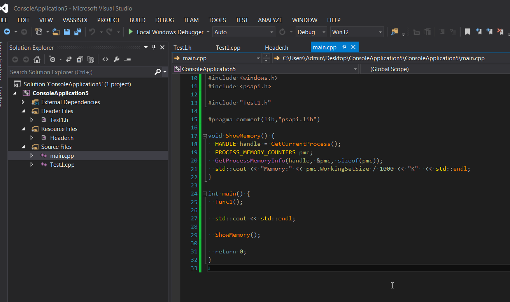

###问题引入###

&nbsp;&nbsp;代码中总能看到有的人喜欢在头文件中定义const变量，或者在头文件中定义const变量。最常见的就是在头文件中定义字符串，例如在头文件def.h中定义变量：

```cpp
// defs.h
static std::string s_str = "Static"; 
const std::string kStr = "Const";
```
这样写就可以在需要用到该字符串的地方引入这个头文件。
</br>
&nbsp;&nbsp;在源文件中引入头文件相当于直接把头文件的内容拷贝到原文件中，如果引入这个头文件后，将会在每个引入的源文件中**重复**定义这些变量。在C++中这样的代码是可以编译通过的，但是在C语言编译器中是不能编译通过的。
</br>
</br>

### C编译器情况 ###

&nbsp;&nbsp; 如果在头文件中定义**static**变量，在多个源文件中引入是**可以编译通过**的，因为相当于在每个源文件中定义了一个static变量，而static变量的作用域限定在这个源文件内的。
&nbsp;&nbsp;如果在头文件中定义了**const**变量，在多个源文件中引入是**不能编译通过**的，因为const没有限定作用域，每个文件都定义这个变量，会出现重复定义的错误。如下：
> fatal error LNK1169: one or more multiply defined symbols found

</br>
</br>

### C++编译器情况 ###

&nbsp;&nbsp;在C++的头文件定义**const或static**变量，引入到多个源文件都是**可以编译通过**的。但是导致也导致了重复定义变量的问题。

&nbsp;&nbsp;接下来用代码验证一下，在一个头文件中定义一个const变量，当引入到多个源文件中，查看该类的构造函数调用过几次，以及内存的变化情况。如果该头文件引入到3个文件中，那么该类的构造函数应该调用3次，内存也会明显增加。
</br>

1.头文件header.h
```cpp
// header.h
#pragma once

#include <iostream>
#include <string>

struct LargeObject {
  int* p;

  LargeObject() {
    p = new int[100000000];
    std::cout << "Construct" << std::endl;
  }

  ~LargeObject() {
    delete p;
  }
};

const LargeObject kLargeObject;

const std::string kStr = "string";

```

2.将header.h引入到Test1.cpp中。
```cpp
// Test1.h
#pragma once

void Func1();

```
```cpp
// Test1.cpp
#include "Test1.h"
#include "Header.h"

void Func1() {
  // 输出kLargeObject 的地址。
  std::cout << "Large Object : " << &kLargeObject << std::endl;
  // 输出kStr 的地址。
  std::cout << "String: " << &kStr << std::endl;
}


```
</br>
3.在main.cpp中输出内存。

```cpp
#include <iostream>
#include <string>
#include <windows.h>
#include <psapi.h>

#include "Test1.h"

#pragma comment(lib,"psapi.lib")

void ShowMemory() {
  HANDLE handle = GetCurrentProcess();
  PROCESS_MEMORY_COUNTERS pmc;
  GetProcessMemoryInfo(handle, &pmc, sizeof(pmc));
  std::cout << "Memory:" << pmc.WorkingSetSize / 1000 << "K"  << std::endl;
}

int main() {
  Func1();

  std::cout << std::endl;

  ShowMemory();

  return 0;
}

```
  输出结果为：
  


4.将header.h引入到Test2.cpp中。
```cpp
// Test2.h
#pragma once

void Func2();

```
```cpp
// Test2.cpp
#include "Test2.h"

#include "Header.h"

void Func2() {
  // 输出kLargeObject 的地址。
  std::cout << "Large Object : " << &kLargeObject << std::endl;
  // 输出kStr 的地址。
  std::cout << "String: " << &kStr << std::endl;
}

```
5.在main.cpp中输出内存。
```cpp
#include <iostream>
#include <string>

#include <windows.h>
#include <psapi.h>

#include "Test1.h"
#include "Test2.h"

#pragma comment(lib,"psapi.lib")

void ShowMemory() {
  HANDLE handle = GetCurrentProcess();
  PROCESS_MEMORY_COUNTERS pmc;
  GetProcessMemoryInfo(handle, &pmc, sizeof(pmc));
  std::cout << "Memory:" << pmc.WorkingSetSize / 1000 << "K"  << std::endl;
}

int main() {
  Func1();
  Func2();

  std::cout << std::endl;

  ShowMemory();

  return 0;
}

```
输出结果为：


</br>
**结果对比**：

 1. 结果2的内存明显大于结果1的内存。
 2.  结果2中的构造函数调用了两次，因为该头文件引入了两次。
 3.  结果2中输出的变量地址不同，说明是不同的变量。

</br>
</br>

### 结论 ###

不要直接在头文件中定义const或static变量，更好的写法是在源文件中定义，在头文件中extern声明。例如：
```cpp
// defs.h
extern const std::string kStr;
extern const Student kStu;
```
```cpp
// defs.cpp
const std::string kStr = "String";
const Student kStu("Name");
```
